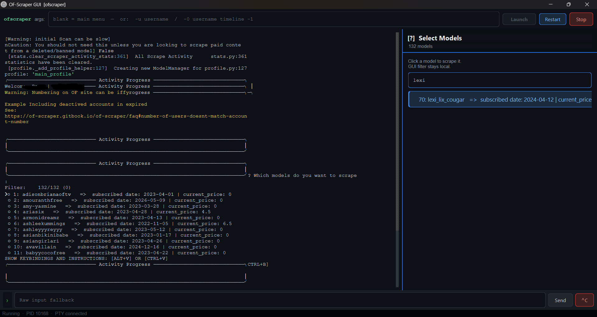
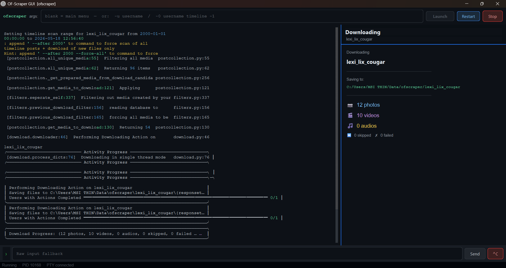

## 2. README.md

```markdown
# OF-Scraper GUI

A PyQt6 graphical interface for [OF-Scraper](https://github.com/datawhores/OF-Scraper) by [@datawhores](https://github.com/datawhores).  
All downloading logic, API access, and content handling is provided by OF-Scraper.  
This project adds a GUI layer on top — no terminal knowledge needed.

---

## What it does

- Replaces all terminal prompts with clickable buttons and panels
- Shows all 132+ subscribed models in a searchable sidebar — click to scrape
- Displays live download progress (photos, videos, save path)
- Handles auth setup, area selection, config editing — all through the GUI

---

## Requirements

- **Windows 10/11** (macOS/Linux: untested but should work)
- **Python 3.10 or newer** — download from [python.org](https://www.python.org/downloads/)  
  ⚠️ During installation, check **"Add Python to PATH"**
- An **OnlyFans account** with active subscriptions
- A working **CDM key** for decrypting DRM content (see below)

---

## Installation

1. Download and extract this repository (Code → Download ZIP)
2. Double-click **`install.bat`** — installs all Python dependencies
3. Double-click **`launch.bat`** to start the GUI

To create a desktop shortcut with the icon:
- Right-click `launch.bat` → Create shortcut
- Right-click the shortcut → Properties → Change Icon → select `OF-GUI.ico`

---

## CDM Keys (required for video downloads)

OF-Scraper uses Widevine DRM decryption to download protected videos.  
The public CDRM service (`cdrm-project.com`) is currently **down indefinitely**.

You have two options:

**Option A — Wait/check for alternative services**  
See the full list of supported CDM modes:  
👉 https://of-scraper.gitbook.io/of-scraper/cdm-options

**Option B — Extract your own keys (advanced)**  
You can dump Widevine L3 keys from an Android emulator using Frida.  
Full guide (updated for 2025): search for *"Dumping Your own L3 CDM with Android Studio"* on VideoHelp forums.

Once you have `client_id.bin` and `private_key.pem`, update your config:
```json
"cdm_options": {
    "private-key": "C:/Users/YOU/OF-Scraper/cdm_keys/private_key.pem",
    "client-id": "C:/Users/YOU/OF-Scraper/cdm_keys/client_id.bin",
    "key-mode-default": "manual"
}
```
Config is at: `C:\Users\YOU\.config\ofscraper\config.json`

## AUTH ISSUES?
> Edit the Auth file yourself!
> Open the file in a Notepad and edit your values in.
Auth is at : `C:\Users\YOU\.config\ofscraper\main_profile/auth.json`


> ⚠️ Never share your CDM keys. Never upload them to GitHub.

---

## First-time setup

1. Launch the GUI and click **Launch**
2. From the Main Menu, select **Edit auth.json file**
3. Follow the prompts to enter your OnlyFans session cookie and tokens  
   (Get these from your browser dev tools while logged into OnlyFans)
4. Once auth is saved, select **Perform Action(s)** → **Download content from a user**

---

## Usage tips

- **Model selector**: type in the filter box to narrow down. Click a model to start scraping.
- **After a successful download**: if you choose "Yes Update Selection" at the reset prompt, click **Restart** in the GUI afterward for the cleanest next run.
- **Download progress**: the right panel shows live photo/video/audio counts and the save path while downloading.
- **Restart button**: use this anytime something looks stuck — it cleanly restarts ofscraper without closing the window.

---

## Folder structure

```
OF-Scraper/
├── gui/               ← GUI source (PyQt6)
├── ofscraper/         ← OF-Scraper source (modified for GUI integration)
├── app.py             ← Entry point
├── launch.bat         ← Start the GUI (Windows)
├── install.bat        ← Install dependencies (run once)
├── requirements_gui.txt
└── OF-GUI.ico
```

---





## Credits

- **OF-Scraper** — the engine behind everything:  
  https://github.com/datawhores/OF-Scraper  
  All credit for downloading, API handling, and content management goes to [@datawhores](https://github.com/datawhores) and contributors.

- This GUI was built as a front-end wrapper. It does not modify any downloading logic.

---

## Disclaimer

This tool is for personal use only. You are responsible for complying with OnlyFans' Terms of Service. Only download content you have purchased or have permission to access.
```

